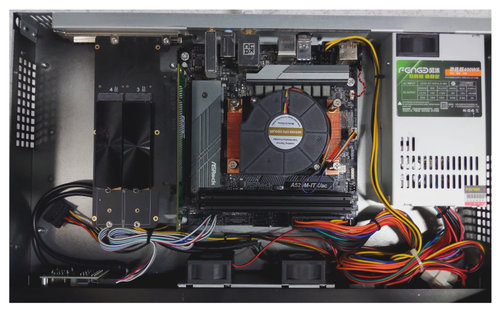

# BKK02 - Validator 2

## CPU

[AMD RYZEN 5 5600G 6-Core 3.7 GHz (4.6 GHz Max Boost) Socket AM4 65W](https://www.amd.com/en/products/cpu/amd-ryzen-5-5600g)

The heart of our operations, the 6-core AMD RYZEN 5 5600G, offers excellent
performance for blockchain applications. It provides robust and reliable
service even under demanding workloads.

## CPU Cooler

[COOLSERVER P32 CPU Cooler](https://aliexpress.com/item/1005004050053958.html)

For managing the thermal performance of our CPU, we use the COOLSERVER P32 CPU
Cooler. It's equipped with high-quality heatpipes and can handle the Ryzen 5
5600G even under intensive workloads.

## RAM

[2x32GB Hynix DDR4 3200MHz](https://www.amazon.co.jp/-/en/v-color-Skywalker-PC4-25600-Heatsink-TO432G32D816ASPSXKN/dp/B08PPDDPFY)

Our setup uses 2 modules of 32GB DDR4 RAM from Hynix, providing us with ample
bandwidth and ensuring smooth server operations.

## Motherboard

[MSI A520M-ITX/ac](https://www.msi.com/Motherboard/A520M-ITX-AC)

The MSI A520M-ITX/ac motherboard is an engineering marvel that brings together
the performance of the consumer world with the dependability of server-grade
hardware. This motherboard supports the AMD Ryzen series CPUs and DDR4 memory,
promising speed, reliability, and scalability.

## Storage

[4x 2TB NVME Monster Storage 3D TLC SSD - R:7400Mb/s W:6,600MB/s](https://www.amazon.co.jp/-/en/dp/B0BZCVVKNY)

For storage, we use 4 Monster Storage 3D TLC NVMe SSDs, each of 2TB capacity.
These high-speed SSDs are known for their exceptional performance and
efficiency in data storage and retrieval. Downside is that lacks DRAM for caching.

## Power unit

[400W PSU](https://lazada.co.th/products/i4470266272-s18039576717.html)

This second-hand case comes with an integrated 400W Power Supply Unit. The PSU
is essential for providing power to your internal components. It converts the
power from the wall outlet into a usable form for your computer's components.
Despite being second-hand, the PSU is in good condition and will provide a
reliable power source for your system.

## Chassis

[Mini-ITX 1U chassis](lazada.co.th/products/i4470266272-s18039576717.html)

This second-hand case comes with an integrated 400W Power Supply Unit. The PSU
is essential for providing power to your internal components. It converts the
power from the wall outlet into a usable form for your computer's components.
Despite being second-hand, the PSU is in good condition and will provide a
reliable power source for your system.

## KVM

[BliKVM v1 CM4 "KVM over IP" Raspberry Pi CM4 HDMI CSI PiKVM v3](https://aliexpress.com/item/1005003262886521.html)

A modern, highly secure, and programmable KVM solution running on Arch Linux,
which provides exceptional control over your server, akin to physical access.
With an easy build process, it boasts minimal video latency (about 100 ms) and
a lightweight Web UI accessible from any browser. It emulates mass storage
drives and allows ATX power management, secure data transmission with SSL, and
local Raspberry Pi health monitoring. You can also manage GPIO and USB relays
via its web interface. The PiKVM OS is production-ready, supports a read-only
filesystem to prevent memory card damage, offers extensible authorization
methods, and enables automation with macros.

### Features of PiKVM:

- **Fully-featured and modern IP-KVM:** PiKVM is up-to-date with the latest KVM technologies.
- **Easy to build:** PiKVM offers ready-to-use OS images and a friendly build environment.
- **Low video latency:** With approximately 100 milliseconds of video latency, it provides
one of the smallest delays of all existing solutions.
- **Lightweight Web UI and VNC:** The user interface is accessible through any browser,
with no proprietary clients required. VNC is also supported.
- **Mass Storage Drive Emulation:** On Raspberry Pi 4 and ZeroW, PiKVM can emulate a virtual
CD-ROM or Flash Drive. A live image can be uploaded to boot the attached server.
- **ATX power management:** PiKVM supports simple circuits for controlling the power
button of the attached server.
- **Security:** PiKVM is designed with strong security, using SSL to protect traffic.
- **Local monitoring:** PiKVM monitors the health of the Raspberry Pi board and provides
warnings for potential issues.
- **GPIO management:** Control GPIO and USB relays via the web interface.
- **Production-ready:** PiKVM OS is based on Arch Linux ARM and can be customized for any needs.
- **Read-only filesystem:** The OS runs in read-only mode to prevent damage to the memory
card due to a sudden power outage.
- **Extensible authorization methods:** PiKVM supports integration into existing
authentication infrastructure.
- **Macro scripts:** Repetitive actions can be automated with keyboard & mouse action macros.
- **Open & free:** PiKVM is open-source software, released under the GPLv3.
