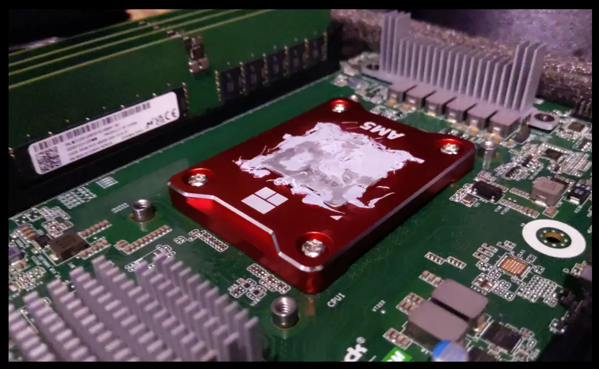

# BKK03 - Bootnode/RPC


## CPU: AMD Ryzen™ 9 7950X3D 16-Core 32-Thread 5NM

### [Product Link](https://www.amd.com/en/products/apu/amd-ryzen-9-7950x3d)

The AMD Ryzen 9 7950X3D, with its 16-core 32-thread architecture, is the
driving force behind our server's high performance. The CPU's multi-core design
and high clock speeds are specifically optimized for blockchain applications,
ensuring efficient chain synchronization and reliable endpoint service.

Featuring advanced technologies like PCI Express® 5.0 and DDR5, the CPU
provides rapid data transfer, essential for low-latency blockchain
transactions. The large 128MB L3 cache further bolsters performance by
facilitating quick access to frequently used data, enhancing efficiency.

## CPU Cooling System



### [COOLSERVER P32 CPU Cooler](https://aliexpress.com/item/1005004050053958.html)
### [Thermalright aluminium alloy AM5 frame](https://aliexpress.com/item/1005004904430608.html)

Cooling efficiency is paramount in maintaining stable performance. Our server
utilizes the COOLSERVER P32 AM5 Server CPU Cooler, in conjunction with the
Thermalright AM5 frame, to maximize cooling capabilities.

## Motherboard: AsRock Rack B650D4U-2L2T/BCM(LGA 1718) Dual 10G LAN

### [Product Link](https://www.amazon.com/dp/B0BXRFHDQT)

This Micro-ATX motherboard stands as a testament to AsRock's engineering
prowess, blending high-performance consumer technology with the robustness of
server-grade hardware. The board offers full PCIe 5.0 support and features up
to 7 M.2 slots for NVMe storage, enhancing data transfer speeds. Its
compatibility with DDR5 ECC UDIMM memory further underlines its suitability for
demanding server applications.

## Memory: 4x 32GB MICRON DDR5 UDIMM/ECC 4800MHz

### [Product Link](https://www.amazon.com/Server-Memory-Module-4800MHz-MTC20C2085S1EC48BA1R)

Our selection of server-grade DDR5 memory modules provides substantial
bandwidth for smooth server operations. Equipped with ECC technology, these
modules maintain data integrity, ensuring the reliability of our transactions.

## SSD Expansion: NVMe PCIe RAID Adapter 4 Ports NVME SSD to PCI-E 4.0 X16

This expansion card plays a vital role in our data management strategy by
enabling the integration of top-tier NVMe SSDs. It contributes to our server's
responsiveness by facilitating faster access to stored data.

## Storage: 5x 2TB Hanye ME70 NVMe PCI-E4.0 7200mb/s

### [Product Link](https://www.amazon.co.jp/Hanye-%E3%80%90PS5%E5%8B%95%E4%BD%9C%E7%A2%BA%E8%AA%8D%E6%B8%88%E3%81%BF%E3%80%91-PCIe-Gen4x4-DRAM%E6%90%AD%E8%BC%89/dp/B0B58JXNXG)

Our system's storage is equipped with 2TB High-Performance ME70 M.2 NVMe SSDs,
providing 12TB of high-speed storage. The SSDs' Gen4 PCIe tech and LDPC error
correction ensure quick data access and integrity.

## Benchmarks

```
2023-07-31 13:55:08 Running machine benchmarks...
2023-07-31 13:55:34
+----------+----------------+-------------+-------------+-------------------+
| Category | Function       | Score       | Minimum     | Result            |
+===========================================================================+
| CPU      | BLAKE2-256     | 1.56 GiBs   | 783.27 MiBs | ✅ Pass (203.8 %) |
|----------+----------------+-------------+-------------+-------------------|
| CPU      | SR25519-Verify | 788.10 KiBs | 560.67 KiBs | ✅ Pass (140.6 %) |
|----------+----------------+-------------+-------------+-------------------|
| Memory   | Copy           | 27.73 GiBs  | 11.49 GiBs  | ✅ Pass (241.3 %) |
|----------+----------------+-------------+-------------+-------------------|
| Disk     | Seq Write      | 2.99 GiBs   | 950.00 MiBs | ✅ Pass (322.0 %) |
|----------+----------------+-------------+-------------+-------------------|
| Disk     | Rnd Write      | 1.29 GiBs   | 420.00 MiBs | ✅ Pass (313.4 %) |
+----------+----------------+-------------+-------------+-------------------+
From 5 benchmarks in total, 5 passed and 0 failed (10% fault tolerance).
2023-07-31 13:55:34 The hardware meets the requirements
Read Latency Statistics in nanoseconds:
-------------------------
Minimum: 520 ns
Maximum: 22540 ns
Mean: 914.595734 ns
Standard Deviation: 222.087316 ns
Read IOPS: 953140.861971
```

## Chassis: 1U Case, TGC H1-400

### [Product Link](https://www.pcgallery.co.th/product/tgc-h1-400/)

## Power Supply Unit: 400W Compuware 80 PLUS Platinum PSU

### [Vendor Link](https://www.pcgallery.co.th/)

## KVM: Asrock Rack BCM/IPMI

The AsRock Rack motherboard includes a BCM for remote control, offering robust
management capabilities.
