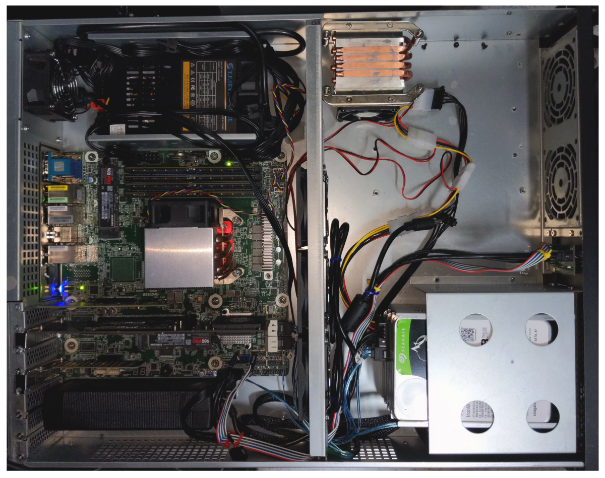
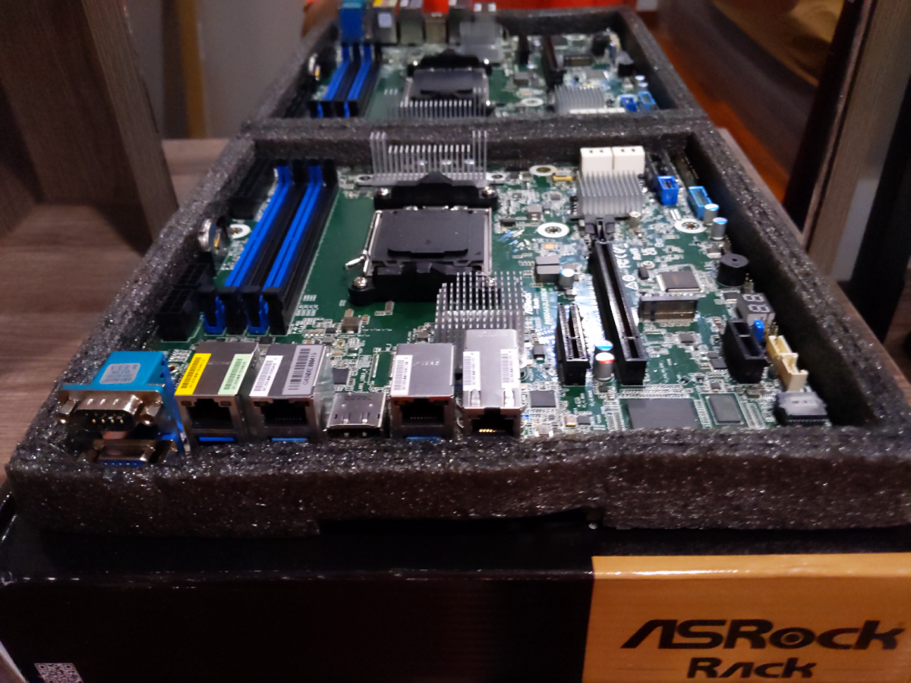
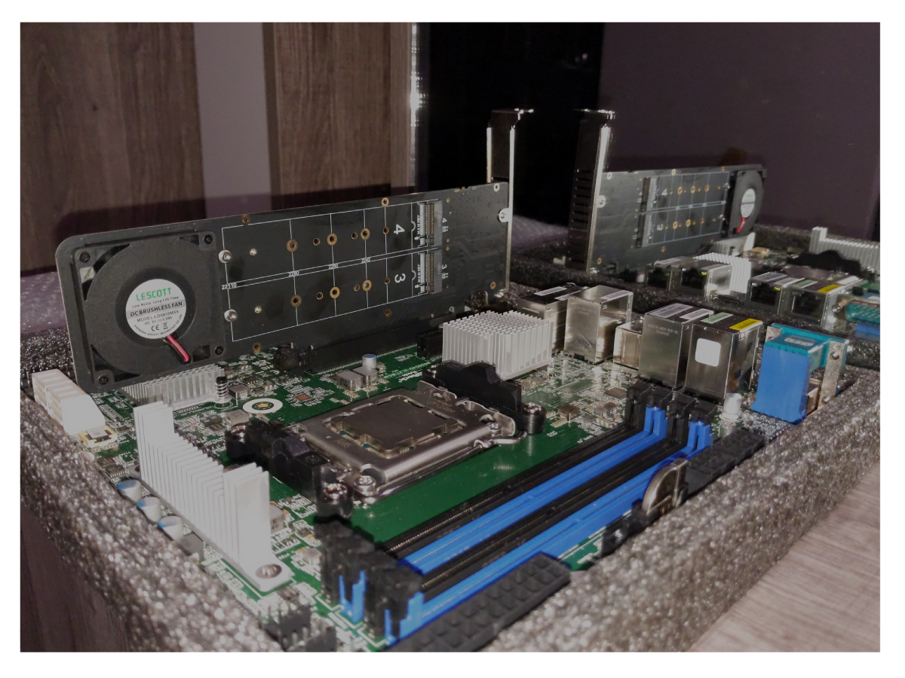

## BKK04 - Bootnode/RPC


### CPU
**Model:** [AMD Ryzen 9 7950X R9 7950X CPU Processor 16-Core 32-Thread 5NM L3=64M Socket AM5](https://www.amd.com/en/products/cpu/amd-ryzen-9-7950x)

- **Core Count:** 16 cores
- **Technology:** 5NM process
- **L3 Cache:** 64MB
- **PCI Express:** 5.0
- **Memory Support:** DDR5

**Capabilities:** Designed to manage multiple tasks with ease, such as running
multiple networks simultaneously, efficient blockchain sync, and low latency
transactions.

#### CPU Cooler
- **Model:** [COOLSERVER R64 AM5 Server CPU Cooler](https://aliexpress.com/item/1005004850411911.html)
- **Design:** 4 high-quality heatpipes, 150W TDP, double ball bearing
- **Enhancement:** [Thermalright aluminium alloy AM5 frame](https://aliexpress.com/item/1005004904430608.html)

### Motherboard

**Model:** [AsRock Rack B650D4U(LGA 1718)](https://www.asrockrack.com/general/productdetail.asp?Model=B650D4U#Specifications)

- **Form Factor:** Micro-ATX
- **Memory Support:** DDR5 ECC UDIMM
- **PCIe Slots:** Full PCIe 5.0 support, M.2 slot, x16 slot, and x4 slot
- **Storage Support:** Up to 7 M.2 slots

### Memory
**Model:** [4x Server Memory Module|MICRON|DDR5|32GB|UDIMM/ECC|4800MHz|CL 40|1.1V|MTC20C2085S1EC48BA1R](https://www.amazon.com/Server-Memory-Module-4800MHz-MTC20C2085S1EC48BA1R)

- **Capacity:** 4 modules of 32GB DDR5 each
- **Technology:** ECC for increased data integrity
- **Performance:** Low-latency

### SSD Expansion Cards

- **Model:** NVMe SSD Expansion Card NVMe PCIe RAID Adapter 4 Ports NVME SSD To
PCI-E 4.0 X16 Expansion Card

### Storage
- **Primary Storage:** 6x 2TB Samsung SSD Pro 980
- **Backup Storage:** 3x 16TB disks in ZFS RAIDZ (32TB total)

### Benchmarks
```
``+----------+----------------+-------------+-------------+-------------------+
| Category | Function       | Score       | Minimum     | Result            |
+===========================================================================+
| CPU      | BLAKE2-256     | 1.65 GiBs   | 783.27 MiBs | ✅ Pass (215.8 %) |
|----------+----------------+-------------+-------------+-------------------|
| CPU      | SR25519-Verify | 832.82 KiBs | 560.67 KiBs | ✅ Pass (148.5 %) |
|----------+----------------+-------------+-------------+-------------------|
| Memory   | Copy           | 16.99 GiBs  | 11.49 GiBs  | ✅ Pass (147.9 %) |
|----------+----------------+-------------+-------------+-------------------|
| Disk     | Seq Write      | 2.09 GiBs   | 950.00 MiBs | ✅ Pass (225.3 %) |
|----------+----------------+-------------+-------------+-------------------|
| Disk     | Rnd Write      | 885.35 MiBs | 420.00 MiBs | ✅ Pass (210.8 %) |
+----------+----------------+-------------+-------------+-------------------+
From 5 benchmarks in total, 5 passed and 0 failed (10% fault tolerance).
2023-08-03 00:49:00 The hardware meets the requirements
Read Latency Statistics in nanoseconds:
-------------------------
Minimum: 460 ns
Maximum: 535014 ns
Mean: 968.885148 ns
Standard Deviation: 280.737214 ns
99.99th Percentile Read Latency: 350 ns
-------------------------
Read IOPS: 906996.500117

The read latency meets the 2000 ns and lower QoS requirement
```

### Chassis
- **Model:** [TGC-24550 2U](https://www.pcgallery.co.th/product/tgc-24550-3-0/)
- **Design:** 2U rackmount, efficient airflow design

### Power Supply Unit
- **Model:** T.F.SKYWINDINTL 1U MINI Flex ATX Power Supply Unit 400W Modular
PSU
- **Capacity:** 400W
- **Features:** Built-in cooling fan, overcurrent, overvoltage, and
short-circuit protection

### KVM
- **Model:** Asrock Rack BCM/IPMI for remote control

### Summary

The BKK04 Bootnode leverages a combination of cutting-edge components to
deliver high performance, reliability, and scalability. From the AMD Ryzen 9
7950X processor with 32 threads high core clock cycles to the efficient memory
and robust storage solutions, every part of this server is designed to handle
demanding server applications, particularly those related to blockchain
processing. The use of advanced cooling and power supply units ensures
long-term sustainability and stable operation. All components have been
chosen as well to be most energy efficient solutions that market can currently
provide.
