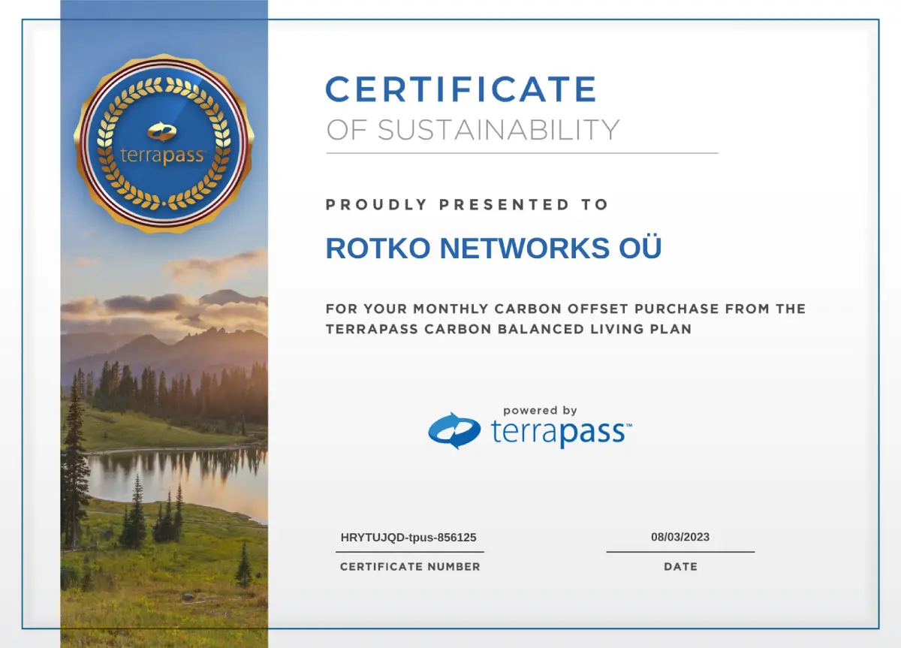

# Minimizing Our Carbon Footprint

In the relentless march of blockchain technology, we've chosen a path less
trodden. Our commitment isn't just to innovation, but to the delicate balance
between progress and planetary health.

## Polkadot

We've anchored our on-chain operations to the Polkadot network. It's not merely
a blockchain; it's a testament to what's possible when brilliant minds converge
on the problem of sustainable computation. Polkadot doesn't just process
transactions—it redefines the very notion of blockchain efficiency.

## The Migration to Conscious Computing

Our servers have found a new home in STT's cutting-edge data center. It's more
than a facility; it's a bold statement against the status quo of energy-hungry
tech. By 2030, it aims to erase its carbon footprint entirely. Today, it already
neutralizes 100% of its emissions—a rare beacon of responsibility in our industry.

### The Numbers Don't Lie

Our current rack sip a mere 595.1 kWh monthly. In Thailand's energy landscape,
that translates to 335 kg of CO2 equivalent. It's a number we're not satisfied
with, but one we're actively working to drive down to zero.

## The Road Ahead

Our journey with STT and Polkadot isn't just about ticking boxes or greenwashing
our image. It's a fundamental shift in how we view the relationship between
technology and our planet. We're not waiting for regulations or market
pressures—we're driving change from within.

