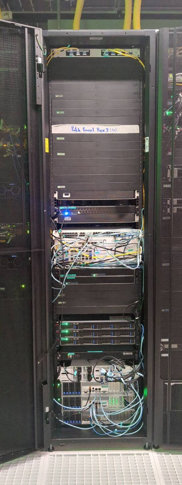

# Hardware Infrastructure

Our primary goal is to deliver a high-performance and secure blockchain
infrastructure that fosters trust and reliability. We aim to achieve this by
focusing on the critical elements of blockchain technology - namely, ensuring
high single-thread performance for validator services, and low latency for RPC
services, among others.

## Network Architecture

For reference, our network topology includes the following components:

### Upstream Providers
- BKNIX, AMS-IX (Bangkok, Hong Kong, Europe)
- HGC IPTX (Hong Kong, Singapore)
- Backup circuits: HGC IPTX TH-HK and TH-SG

### Edge Routers
- BKK00 (MikroTik CRR2216)
- BKK20 (MikroTik CRR2216)

### Core Routers
- BKK10 (MikroTik CRR2116) - VRRP Primary
- BKK50 (MikroTik CCR2004) - VRRP Fallback

### Storage Infrastructure
- High-speed switches: BKK30, BKK40 (100G)
- Storage servers: BKK06 (EPYC 7713), BKK07 (EPYC 9654), BKK08 (EPYC 7742)
- HA Quorum Network for redundancy

### Validator Nodes
- BKK01, BKK02 (Ryzen 5600G)
- BKK03 (Ryzen 7950X3D)
- BKK04 (Ryzen 9950X)
- BKK09 (Ryzen 7945HX)
- BKK11, BKK13 (Ryzen 5950X)
- BKK12 (Ryzen 7950X)

### Management
- BKK60 (MikroTik CRS354) for IPMI access to all devices

## Performance Considerations

Validator services in blockchain infrastructures demand high single-thread performance due to the nature of their operations. Validators, in essence, validate transactions and blocks within the blockchain. They act as the arbitrators of the system, ensuring the veracity and accuracy of the information being added to the blockchain. This is an intensive process that involves complex computations and encryption, thus requiring a high-performance, single-thread system to maintain efficiency.

The low latency required for our RPC services is another vital factor in our hardware design. RPC, or Remote Procedure Call, is a protocol that allows a computer program to execute a procedure in another address space, usually on another network, without the programmer needing to explicitly code for this functionality. In simpler terms, it's a way for systems to talk to each other. Low latency in these operations is crucial to ensure a smooth and seamless dialogue between various systems within the blockchain. A delay or a lag in these communications can cause bottlenecks, leading to a slowdown in overall operations.

## Hardware Specifications

The hardware components and their configurations we have selected are 
specifically designed to address these needs. By leveraging advanced technologies
like the AMD Ryzen 9 7950X for its superior single-thread performance, DDR5
memory for fast data retrieval, and NVMe SSDs for their exceptional speed in
data storage and retrieval, we aim to provide an infrastructure that can
effectively handle the demands of blockchain technology.

### Key Components

| Node Type | Processor | Memory | Storage | Purpose |
|-----------|-----------|--------|---------|---------|
| Validator | AMD Ryzen 7950X/5950X | DDR5 | NVMe SSDs | Transaction validation |
| Storage | AMD EPYC 7713/9654/7742 | High-capacity | Redundant arrays | Blockchain data storage |
| Edge | MikroTik CRR2216 | - | - | Network edge routing |
| Core | MikroTik CRR2116/CCR2004 | - | - | VRRP redundant core routing |

## Scalability and Resilience

Our infrastructure is also designed to ensure scalability and flexibility. As
the demands of the blockchain ecosystem grow, so too should our capacity to
handle these increasing demands. Hence, our hardware design also incorporates
elements that will allow us to easily scale up our operations when necessary.

The network features full redundancy with:
- Cross-connected edge routers with multiple upstream providers
- Geographic diversity with connections to Hong Kong, Singapore, Bangkok, and Europe
- Backup IPTX circuits for fallback connectivity
- VRRP router redundancy for core routing
- High-speed 100G storage networking
- HA Quorum Network for storage resilience

In essence, our hardware is purpose-built to deliver high-performance blockchain
operations that are secure, reliable, and capable of scaling with the demands of
the evolving blockchain ecosystem.
