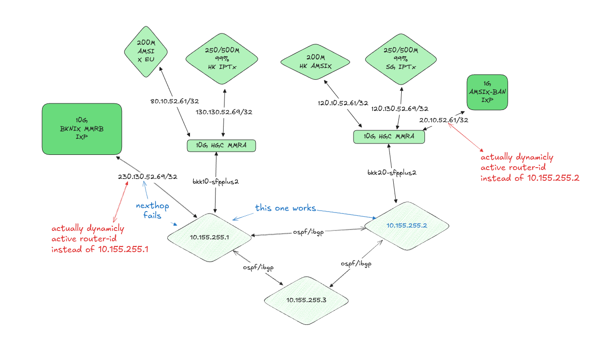

# Network Outage Postmortem (2024-12-19/20)

## Summary
A planned intervention to standardize router-id configurations across our edge
routing infrastructure resulted in an unexpected connectivity loss affecting our
AMSIX Amsterdam, BKNIX, and HGC Hong Kong IPTx peering sessions. The incident
lasted approximately 95 minutes (23:55 UTC to 01:30 UTC) and impacted our validator
performance on both Kusama and Polkadot networks. Specifically, this resulted in
missed votes during Kusama Session 44,359 at Era 7,496 and Polkadot Session
10,010 at Era 1,662 with a 0.624 MVR (missed vote ratio).

## Technical Details
The root cause was traced to an attempt to resolve a pre-existing routing anomaly
where our edge routers were operating with multiple router-ids across different
uplink connections and iBGP sessions. The heterogeneous router-id configuration
had been causing nexthop resolution failures and inability to transit in our
BGP infrastructure.

The original misconfiguration stemmed from an incorrect assumption that router-ids
needed to be publicly unique at Internet exchange points. This is not the case - router-ids
only need to be unique within our Interior Gateway Protocol (IGP)
domain. This misunderstanding led to the implementation of multiple router-ids
in loopback interfaces, creating unnecessary complexity in our routing
infrastructure.

During the remediation attempt to standardize OSPF router-ids to a uniform
value across the infrastructure, we encountered an unexpected failure mode
that propagated through our second edge router, resulting in a total loss of
connectivity regardless of router&&uplink redundancy. The exact mechanism of
the secondary failure remains under investigation - the cascade effect that
caused our redundant edge router to lose connectivity suggests an underlying
architectural vulnerability in our BGP session management.

## Response Timeline
- 23:55 UTC: Initiated planned router-id standardization
- ~23:56 UTC: Primary connectivity loss detected
- ~23:56 UTC: Secondary edge router unexpectedly lost connectivity
- 01:30 UTC: Full service restored via configuration rollback

## Mitigation
Recovery was achieved through an onsite restoration of backed-up router
configurations. While this approach was successful, the 95-minute resolution
time indicates a need for more robust rollback procedures and most of all
precaution during network configuration.

## Impact
- Kusama validator session 44,359 experienced degraded performance with MVR 1 in Era 7,496 and missed votes in Era 7,495
- Polkadot validator session 10,010 experienced degraded performance with 0.624 MVR in Era 1,662
- Temporary loss of peering sessions with AMSIX, BKNIX, and HGC Hong Kong IPTx

## Current Status and Future Plans
The underlying routing issue (multiple router-ids in loopback) remains unresolved.
Due to the maintenance freeze in internet exchanges during the holiday period,
the resolution has been postponed until next year. To ensure higher redundancy
during the next maintenance window, we plan to install a third edge router
before attempting the configuration standardization again.

## Future Work
1. Implementation of automated configuration validation testing
2. Enforce usage of Safe Mode during remote maintenance to prevent cascading failures
3. Investigation into BGP session interdependencies between edge routers
4. Read [RFC 2328](https://www.ietf.org/rfc/rfc2328.txt) to understand actual
   protocol and how vendor implementation differ
5. Installation and configuration of third edge router to provide N+2 redundancy
    during upcoming maintenance
6. Study route reflector architechture to move route management from edge
   routers to centralized route server like birdc that is known for correctness
   in implementation of RFC specs.
7. Implementation of [RFC 8195](https://www.rfc-editor.org/rfc/rfc8195.html) for improved traffic steering via large BGP communities
