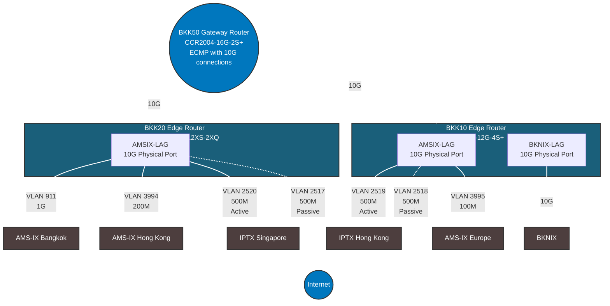

# Network Configuration Documentation

## Overview

This document outlines the BGP routing configuration for our multi-homed network
with connections to various internet exchanges and transit providers in Bangkok,
Hong Kong, Singapore, and Europe. Currently 3x 10G fibers are used for physical
uplinks.

## Bandwidth


# Network Topology Diagram


## Routing Configuration

| Name              | Speed | Path Prepend | MED | Local Pref | External Communities | Description | Router |
|-------------------|-------|--------------|-----|------------|-------------------|-------------|---------|
| BKNIX             | 10G   | 0            | 10  | 200        | 142108:1:764 | Local IX | BKK10 |
| AMS-IX Bangkok    | 1G    | 0            | 20  | 190        | 142108:1:764 | Local IX | BKK20 |
| IPTX Singapore-BKK10 | 500M | 1          | 50  | 170        | 142108:2:35 | Regional Transit | BKK10 |
| IPTX Singapore-BKK20 | 500M | 1          | 50  | 160        | 142108:2:35 | Regional Transit | BKK20 |
| AMS-IX Hong Kong  | 200M  | 2            | 100 | 150        | 142108:2:142 | Regional IX | BKK20 |
| IPTX HK-BKK20     | 500M  | 2           | 100 | 130        | 142108:2:142 | Regional Transit | BKK20 |
| IPTX HK-BKK10     | 500M  | 2           | 100 | 120        | 142108:2:142 | Regional Transit | BKK10 |
| AMS-IX EU         | 100M  | 3            | 200 | 100        | 142108:2:142 | Remote IX | BKK10 |

This way:
1. We keep our internal communities for our own routing decisions
2. We share geographic information allowing peers to optimize their routing
3. Peers can make informed decisions about traffic paths to our network

Would this be a useful approach?

## Traffic Engineering Principles

1. Local Preference: Higher values indicate more preferred routes. Local routes are preferred over regional, which are preferred over remote routes.
2. MED (Multi-Exit Discriminator): Lower values are preferred. Used to influence inbound traffic when other attributes are equal.
3. AS Path Prepending: Increases AS path length to make a route less preferred. Used for coarse control of inbound traffic.

## HGC Circuit Configuration for ROTKO NETWORKS OÜ


The following circuits terminate at STT Bangkok 1 Data Center, MMR 3A facility
in Bangkok, Thailand. All circuits are delivered to ROTKO NETWORKS OÜ
infrastructure.

### Primary Transit Circuits

**Circuit PP9094729 (OTT00003347)**
- Service: 400M (Burst to 800M) Thailand IPTx FOB Hong Kong
- Delivery: Customer Headend #2 (PEH8001159)
- **VLAN: 2519**
- Status: Hot upgrade + renewal

**Circuit PP9094730 (OTT00003348)**  
- Service: 400M (Burst to 800M) Thailand IPTx FOB Singapore
- Delivery: Customer Headend #1 (PEH8001158)
- **VLAN: 2520**
- Status: Hot upgrade + renewal

### Backup Circuits

**Circuit PP9094735 (OTT00003349)**
- Service: 800M Leased Line Internet Service FOB Thailand (Backup)
- Delivery: Customer Headend #1 (PEH8001158)
- **VLAN: 2517**
- Status: Hot upgrade + renewal

**Circuit PP9094736 (OTT00003350)**
- Service: 800M Leased Line Internet Service FOB Thailand (Backup)  
- Delivery: Customer Headend #2 (PEH8001159)
- **VLAN: 2518**
- Status: Hot upgrade + renewal

### Configuration Validation

```
BKK00: HK-HGC-IPTx-vlan2519 (Primary HK - PEH8001159)
BKK00: SG-HGC-IPTx-backup-vlan2518 (Backup SG - PEH8001159)
BKK20: SG-HGC-IPTx-vlan2520 (Primary SG - PEH8001158)  
BKK20: HK-HGC-IPTx-backup-vlan2517 (Backup HK - PEH8001158)
```
