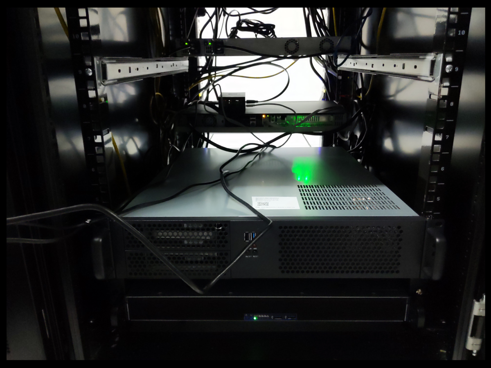

# Rack

At the heart of our operations is a meticulously designed server
infrastructure, securely housed within ten units of a top-tier 42U rack.
Providing approximately 230 liters of computational capacity, our setup is
powered by a robust dual 2kW, 220V power system that underlines our commitment
to delivering superior performance and steadfast availability.

Our server infrastructure is hosted within a carrier-neutral facility,
strategically enabling seamless and robust connections with a broad range of
service providers, ISPs, and cloud platforms. This network versatility fosters
enhanced performance and unyielding reliability, thus ensuring a consistently
superior user experience.

More than a mere assembly of servers, our setup is a comprehensively designed
ecosystem meticulously architected to achieve maximum efficiency. Leveraging
location flexibility, our infrastructure can be configured across multiple
strategic points to guarantee optimal network connectivity and minimized
latency.

Direct peering arrangements with major local and international internet
exchanges ensure broad bandwidth and unwavering connectivity. Coupled with
floor and inter-floor cross-connect cabling, we have fostered a well-connected
network capable of facilitating smooth data transfer between servers and racks.

Our infrastructure is further enhanced with a suite of cutting-edge networking
devices, including industry-leading routers and switches. Services such as KVM
over IP for remote server management, alongside on-site technical support and
smart hands as a service, amplify our operational efficiency.

To guarantee optimal performance and longevity of our hardware, a tightly
regulated environment is maintained. Our facility features controlled air
temperature and humidity, ensuring the hardware operates within optimal
conditions. Additionally, we have installed a UPS and backup power generators
to mitigate the risk of power interruptions.

Security is paramount. Our facility, with ISO 27001 certification, employs a
rigorous system of access control with logging and video surveillance, ensuring
a safe and secure environment for our infrastructure. Additional safety
measures such as fire alarms and smoke protection systems are in place to
protect our hardware. A dedicated network operations center, operational 24/7,
stands ready to promptly address any technical concerns.

Our setup also incorporates a raised floor design, an element that demonstrates
our meticulous attention to detail. This design improves air distribution and
cable management, leading to thermal efficiency and a well-organized
operational environment. 

### Links
- [Rittal 42U](https://www.rittal.com/com-en/products/PG0900ZUBEHOER1/PG0919ZUBEHOER1)
