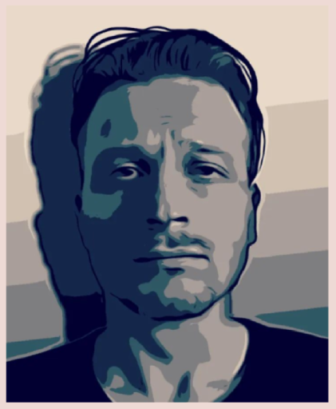
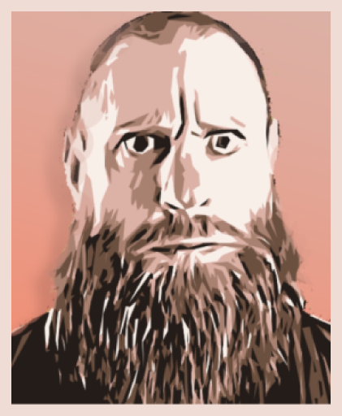
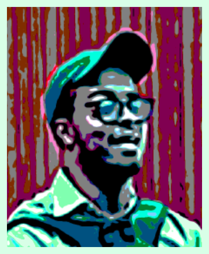
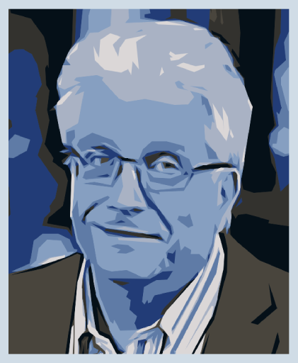

<h1>Team</h1>

<h3>Tommi</h3>

<h4>Founder</h4>

 

Tommi, the founder of Rotko Network, represents a generation that mastered the
QWERTY keyboard before perfecting handwriting. With over two decades of
experience in building hardware, software, and managing servers, Tommi's
journey through the digital landscape is as old as the commercial internet
itself.

His adventure with Bitcoin began in 2008, running the first version on a
Pentium D950. However, it wasn't until 2013, when Snowden's revelations
confirmed his most paranoid thoughts about mass surveillance, that Tommi fully
grasped the importance of decentralized systems. He realized that the
internet, once a user-driven landscape, had fallen under the control of a
handful of corporations, compromising user privacy and freedom.

This eye-opening realization led to the creation of Rotko Network. Tommi's
mission is to reshape the internet into a space truly owned by its users,
where privacy is fundamental and centralized control is minimized. With the
dedication of a seasoned software enthusiast and the heart of a digital
freedom fighter, Tommi stands at the helm of this initiative, working to end
data exploitation and build a user-centric, user-owned internet infrastructure.

<h3>Dan</h3>

<h4>Rust dev</h4>

Meet Dan, a bona fide wizard of programming who cut his teeth coding back in the
90s, drawing inspiration from the music demoscene. With more than two decades
under his belt, he's a seasoned veteran who understands the ins and outs of the
game.

Just like many of us old-timers, he has a deep appreciation for functional
programming and a penchant for clarity in code, with Rust being his go-to
tool. He's got this knack for building software that runs as close to the
metal as possible, extracting every bit of performance he can get.

One of his remarkable feats is constructing intricate drum machines entirely
from scratch, a testament to his understanding of complex systems and
algorithmic creativity. He's not just a coder; he's a craftsman.

<h3>Al</h3>

<h4>DevOps/NOC</h4>

Meet Al, our SEA timezone DevOps maestro, whose journey from pure mathematics
to the world of backend development and deployment is as fascinating as a
well-optimized algorithm. With a fresh master's degree in mathematics, Al's
love affair with Linux was the plot twist that redirected his career path from
abstract theorems to applied math in from of the code.

While his classmates were wrestling with complex integrals, Al was falling
head over heels for the elegance of Linux systems. His setup is a
masterpiece of minimalism and functionality, reflecting the same precision he
once applied to mathematical proofs. You might catch him explaining load
balancing algorithms with the same enthusiasm he once reserved for discussing
the Riemann hypothesis.

But it's in the realm of deployment where Al truly shines. He treats our
infrastructure like a complex equation, constantly seeking the most elegant
solution. His latest obsession? Exploring how NixOS can bring the
immutability and reproducibility of mathematical constants to our systems.
Al's unique background brings a fresh perspective to our team, proving that
in the world of tech, a solid foundation in mathematical thinking is an
invaluable variable in the equation of success.

<h3>Walt</h3>

<h4>DevOps/NOC</h4>

Walt, our Americas timezone NOC virtuoso, is the digital equivalent of a
Swiss Army knife - versatile, reliable, and always ready to tackle the
unexpected. With a rich background in full-stack development and systems
administration, Walt brings a unique perspective that bridges the often
treacherous gap between application development and infrastructure management.
His expertise is a tapestry woven from threads of Linux wizardry, Docker
sorcery, and cloud platform mastery, creating a skillset that's as diverse as
it is deep.

In the realm of automation, Walt is nothing short of a maestro. Armed with
Python and Bash as his instruments, he orchestrates symphonies of scripts that
turn complex, time-consuming tasks into elegant, efficient processes. But
Walt's true superpower lies in his approach to problem-solving. Where others
see insurmountable obstacles, Walt sees puzzles waiting to be solved, often
conjuring creative solutions that leave the rest of the team wondering if he's
secretly a tech wizard in disguise.

<h3>Mikko</h3>

<h4>Advisor</h4>

With over 40 years of diverse and significant technical experience, Mikko is the
ideal advisor for creating Internet and networking infrastructure at Rotko
Networks. His expertise spans across all technical layers, from layer 1
hardware programming to layer 7 application interfaces, making him an essential
asset, especially considering the CEO's top-to-bottom learning path.

His technical journey began in the mid-1980s at Nokia Mobile Phones, where he
hand-wrote UI with NEC's Assembly without a compiler, demonstrating a profound
understanding of low-level programming. His most notable achievement at Nokia
was the invention of the menu buttons on the display, a pioneering feature that
has become ubiquitous in mobile user interfaces.

One of the most noteworthy roles was serving as the IT Manager at the
University of Turku, where he was responsible for managing and upgrading the
entire IT infrastructure, including modern Data Center and network services. He
implemented crucial projects like Datacenter upgrades, WLAN enhancements,
network topology redesigns, and developed vital services such as private cloud
storage and learning platforms.

His profound knowledge of technologies like Novell NetWare, AD, MS Exchange,
backup and storage systems, IIS, ISA Firewall, DNS, and DHCP, coupled with his
broad understanding of both low-level and high-level systems, makes him a
tremendous asset for Rotko Networks. His broad and deep technical expertise
ensures he will provide significant guidance in building a robust and efficient
Internet and networking infrastructure.

